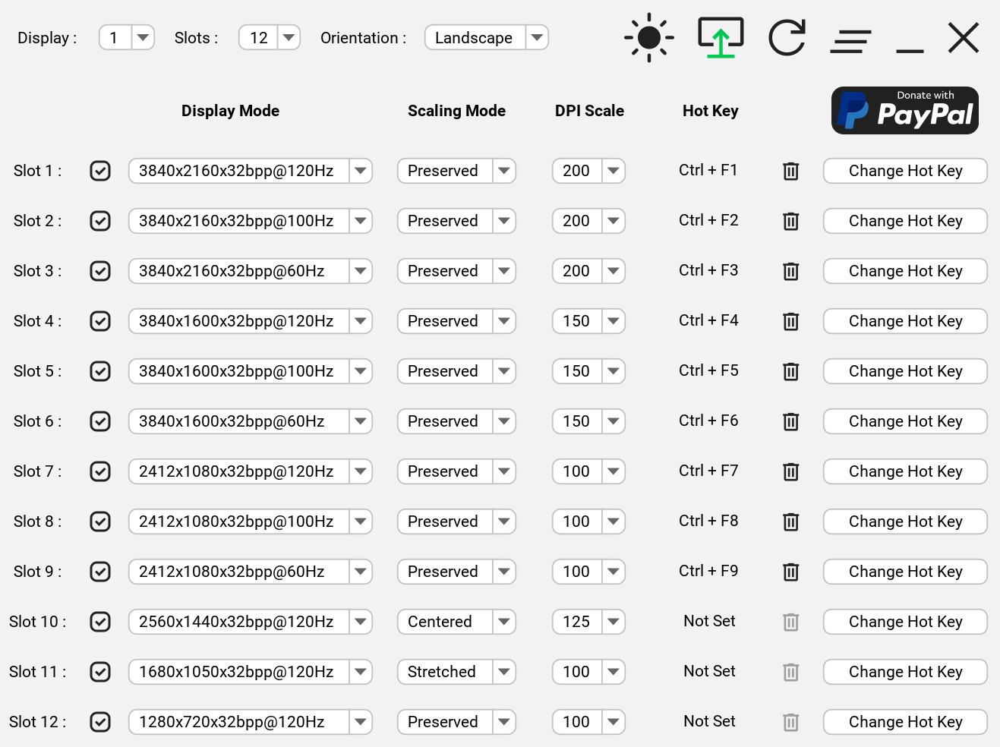

<!-- PROJECT LOGO -->

 

  

  <h3 align="center">Display Hot Keys</h3>

  

    <i>Effortlessly control display settings!</i>
     
    <a href="https://github.com/jon-mil-92/DisplayHotKeys/issues">Report Bug</a>
    ·
    <a href="https://github.com/jon-mil-92/DisplayHotKeys/issues">Request Feature</a>
  

<!-- TABLE OF CONTENTS -->

  
Table of Contents

  <ol>
    <li><a href="#about-the-project">About The Project</a></li>
    <li><a href="#getting-started">Getting Started</a></li>
    <li><a href="#usage">Usage</a></li>
    <li><a href="#roadmap">Roadmap</a></li>
    <li><a href="#license">License</a></li>
    <li><a href="#contact">Contact</a></li>
    <li><a href="#acknowledgments">Acknowledgments</a></li>
  </ol>

<!-- ABOUT THE PROJECT -->

## About The Project

  

 

This project was created to circumvent the tedious navigation of the Windows settings menus to change display settings. With Display Hot Keys, the resolution, bit depth, refresh rate, and display scaling can be changed with user-defined hot keys. This project was created in conjunction with [SetDisplay].

Common use cases for Display Hot Keys:

* Switch refresh rates to quickly enable the Black Frame Insertion or Backlight Strobing capabilities of the display.

* Quickly switch between resolutions with different aspect ratios.

* Enlarge or shrink the elements on screen by instantly changing the display scaling.

* Instantly set a display mode while in a video game. (This is useful if a video game does not support changing the resolution or refresh rate while in-game.)

(<a href="#readme-top">back to top</a>)

<!-- GETTING STARTED -->

## Getting Started

This application was made only for the Windows platform. Display Hot Keys also uses elevated privileges to set display modes while in video games. Therefore, if you have UAC enabled, you will get a UAC prompt upon launching the application. If you no longer wish to see this prompt, you can [disable UAC]. The sections that follow will help you get the application up and running on your PC!

### Prerequisites

* Windows 10 x64 or Windows 11 x64 operating system.

### Installation

This application will be distributed as a portable package and as an installer.

#### Portable

1. Download the zip archive.

2. Unzip the archive.

3. Double-click the DisplayHotKeys executable file or create a shortcut to run it.

#### Installer

1. Download the installer.

2. Run the installer.

3. Follow the installer prompts.

4. Double-click the created shortcut or the DisplayHotKeys executable file in the install location to run it.

(<a href="#readme-top">back to top</a>)

<!-- USAGE -->

## Usage

Currently, Display Hot Keys only works with single-monitor configurations. If a multi-monitor configuration is used, Display Hot Keys will only change the display settings for the primary monitor. Also, **this application will launch minimized to the system tray in the task bar by design**.

### Setting Hot Keys

1. Click the "Change Hot Key" button.

2. Press the key combination for the hot key. (Up to three keys can be used!)

3. Release at least one of the keys to set the hot key.

**Note:** A hot key cannot be a subset of another hot key. For example, you cannot have a hot key of "Ctrl + F1" and another hot key of "Ctrl + Shift + F1".

### Changing Active Hot Key Slots

1. Click the "Slots" drop-down box.

2. Select one of the values.

**Note:** There can be up to 8 active hot keys. If you feel that there should be a higher maximum number of active hot keys, please [request this feature][open issues].

### Selecting Display Settings

1. Select a value in the "Display Mode" drop-down box for the hot key slot.

2. Select a value in the "Display Scale" drop-down box for the hot key slot.

### Application Interaction

* Individual hot keys can be cleared by clicking on the "Clear Hot Key" button for a hot key slot.

* The application can start automatically when the user logs into Windows by clicking on the "Run On Startup" button. The arrow will turn green to indicate that this option is enabled. The application will start minimized to the system tray.

* The theme can be changed between "Light Mode" and "Dark Mode" by clicking on the "Change Theme" button. The icon will change to indicate the current theme.

* All hot key slots can be reset by clicking on the "Clear All Slots" button.

* The application will be minimized to the system tray when the "Minimize To Tray" button is pressed. To restore the application, either double click the system tray icon, or right click the system tray icon and select "Restore".

* To exit the application, click on the "Exit App" button. You can also exit the application from the system tray by clicking on the system tray icon and selecting "Exit".

(<a href="#readme-top">back to top</a>)

<!-- ROADMAP -->

## Roadmap

- [x] Release initial build
- [ ] Add display scaling mode selection per hot key slot
- [ ] Add multi-monitor support

See [open issues] for a full list of proposed features (and known issues).

(<a href="#readme-top">back to top</a>)

<!-- LICENSE -->

## License

Distributed under the [MIT License]. See `LICENSE.txt` for more information.

(<a href="#readme-top">back to top</a>)

<!-- CONTACT -->

## Contact

Jonathan Miller - jonRock1992@gmail.com

(<a href="#readme-top">back to top</a>)

<!-- ACKNOWLEDGMENTS -->

## Acknowledgments

* [SetDisplay] · [MIT License]

* [Java (low-level) System Hook] · [MIT License]

* [FlatLaf - Flat Look and Feel] · [Apache License 2.0]

* [Material Design Icons] · [Apache License 2.0]

* [Apache Maven Assembly Plugin] · [Apache License 2.0]

* [Maven Compiler Plugin] · [Apache License 2.0]

* [JIniFile]

Distribution made possible with the following tools:

* [launch4j]

* [Inno Setup]

(<a href="#readme-top">back to top</a>)

<!-- PAYPAL DONATE -->

<!-- MARKDOWN LINKS -->

[disable UAC]: https://pureinfotech.com/disable-user-account-control-uac-windows-11/
[open issues]: https://github.com/jon-mil-92/DisplayHotKeys/issues
[SetDisplay]: https://github.com/jon-mil-92/SetDisplay
[Java (low-level) System Hook]: https://github.com/kristian/system-hook
[FlatLaf - Flat Look and Feel]: https://github.com/JFormDesigner/FlatLaf
[Material Design Icons]: https://github.com/marella/material-design-icons
[Apache Maven Assembly Plugin]: https://maven.apache.org/plugins/maven-assembly-plugin/index.html
[Maven Compiler Plugin]: https://maven.apache.org/plugins/maven-compiler-plugin/index.html
[JIniFile]: https://github.com/SubZane/JIniFile
[launch4j]: https://launch4j.sourceforge.net/index.html
[Inno Setup]: https://jrsoftware.org/isinfo.php
[MIT License]: https://mit-license.org
[Apache License 2.0]: https://www.apache.org/licenses/LICENSE-2.0
