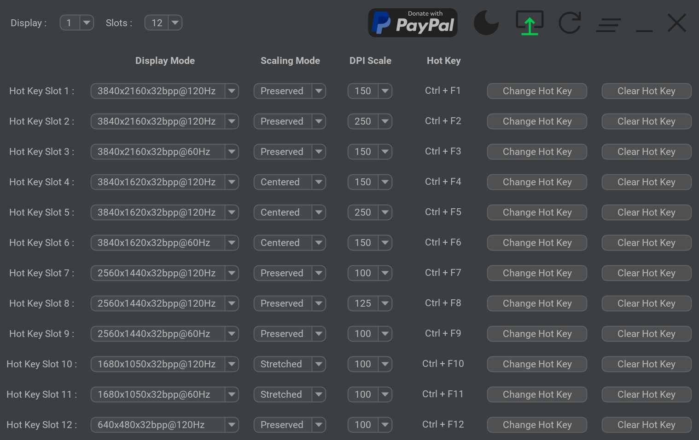

<!-- PROJECT LOGO -->

  
   
  <h3 align="center">Display Hot Keys</h3>
  

    <i>Effortlessly control display settings!</i>
     
    <a href="https://github.com/jon-mil-92/DisplayHotKeys/issues">Report Bug</a>
    <b>·</b>
    <a href="https://github.com/jon-mil-92/DisplayHotKeys/issues">Request Feature</a>
    <b>·</b>
    <a href="https://github.com/jon-mil-92/DisplayHotKeys/releases">Releases</a>
  

<!-- TABLE OF CONTENTS -->

## Table of Contents
<ol>
  <li><a href="#about-the-project">About The Project</a></li>
  <li><a href="#getting-started">Getting Started</a></li>
  <li><a href="#usage">Usage</a></li>
  <li><a href="#roadmap">Roadmap</a></li>
  <li><a href="#license">License</a></li>
  <li><a href="#contact">Contact</a></li>
  <li><a href="#dependencies">Dependencies</a></li>
</ol>

<!-- ABOUT THE PROJECT -->

## About The Project

This project was created to circumvent the tedious navigation of the Windows settings menus to change display settings. With Display Hot Keys, the display resolution, bit depth, refresh rate, scaling mode, and DPI scale percentage can be changed for each connected display with user-defined hot keys.

### Common Use Cases

* Switch refresh rates to quickly enable the Black Frame Insertion or Backlight Strobing capabilities of the display.

* Quickly switch between resolutions with different aspect ratios.

* Immediately apply a resolution without entering the in-game menus for video game benchmarking purposes.

* Enlarge or shrink the elements on screen by instantly changing the DPI scale percentage.

* Instantly set a display mode while in a video game. (This is useful if a video game does not support changing the resolution or refresh rate while in-game.)

### Example Screen

<a href="#readme-top">Back to Top</a>&nbsp; &#x25B2;

<!-- GETTING STARTED -->

## Getting Started

This application was made only for the Windows platform. Display Hot Keys also uses elevated privileges to set display modes while in video games. Therefore, if you have UAC enabled, you will get a UAC prompt upon launching the application. If you no longer wish to see this prompt, you can [disable UAC]. The sections that follow will help you get the application up and running on your PC!

### Prerequisites

* Windows 10 x64 or Windows 11 x64 operating system.

* If using multiple displays, then the "Multiple displays" setting must be set to "Extend these displays" in the Windows "Display" settings menu!

### Installation

This application will be distributed as a portable package and as an installer.

#### Portable

1. Download the zip archive.

2. Unzip the archive.

3. Double-click the DisplayHotKeys executable file or create a shortcut to run it.

#### Installer

1. Download the installer.

2. Run the installer.

3. Follow the installer prompts.

4. Double-click the created shortcut or the DisplayHotKeys executable file in the install location to run it.

<a href="#readme-top">Back to Top</a>&nbsp; &#x25B2;

<!-- USAGE -->

## Usage

This application will launch minimized to the system tray in the task bar by design.

### Setting Hot Keys

1. Click the "Change Hot Key" button.

2. Press the key combination for the hot key. (Up to three keys can be used!)

3. Release at least one of the keys to set the hot key.

**Note:** A hot key cannot be a subset of another hot key. For example, you cannot have a hot key of "Ctrl + F1" and another hot key of "Ctrl + Shift + F1". However, a hot key can be the same as another hot key if they are for different displays. This will allow you to apply display settings for multiple displays with one hot key!

### Changing Displays

1. Click the "Display" drop-down box.

2. Select the display you want to change hot keys for.

**Note:** The application will automatically detect newly disconnected and connected displays, and the application will refresh to reflect the display configuration change.

### Changing Active Hot Key Slots

1. Click the "Slots" drop-down box.

2. Select one of the values.

**Note:** There can be up to 12 active hot key slots for each connected display.

### Selecting Display Settings

1. Select a display mode value in the "Display Mode" drop-down box for the hot key slot.

2. Select a scaling mode value in the "Scaling Mode" drop-down box for the hot key slot.

	* Select "Preserved" to preserve the aspect ratio of the image.
	
	* Select "Stretched" to stretch the image to the edges of the panel.
	
	* Select "Centered" to center the image in the middle of the panel.

3. Select a DPI scale percentage value in the "DPI Scale" drop-down box for the hot key slot.

**Note:** You may need to use GPU Scaling in your display driver settings to prevent the monitor from overriding the scaling mode.

### Button Interaction

#### Clear Hot Key

Individual hot keys can be cleared by clicking on the "Clear Hot Key" button for a hot key slot.

#### PayPal Donate

If you find the application useful and wish to donate, there is a "PayPal Donate" button that will open a PayPal donation web page.

#### Change Theme

The theme can be changed between "Light Mode" and "Dark Mode" by clicking on the "Change Theme" button. The icon will change to indicate the current theme.

#### Run On Startup

The application can start automatically when the user logs into Windows by clicking on the "Run On Startup" button. The arrow will turn green to indicate that this option is enabled. The application will start minimized to the system tray.

#### Refresh App

If you have created a custom display mode while the app is running, there is a "Refresh App" button that will refresh the app to reflect the new display mode.

#### Clear All Slots

All hot key slots for the selected display can be reset by clicking on the "Clear All Slots" button.

#### Minimize To Tray

The application will be minimized to the system tray when the "Minimize To Tray" button is pressed. To restore the application, click the system tray icon and select "Restore".

#### Exit App

To exit the application, click on the "Exit App" button. You can also exit the application from the system tray by clicking on the system tray icon and selecting "Exit".

<a href="#readme-top">Back to Top</a>&nbsp; &#x25B2;

<!-- ROADMAP -->

## Roadmap

- [x] &nbsp; Release the initial build.
- [x] &nbsp; Add scaling mode selection.
- [x] &nbsp; Add multi-monitor support.

See [open issues] for a full list of proposed features (and known issues).

<a href="#readme-top">Back to Top</a>&nbsp; &#x25B2;

<!-- LICENSE -->

## License

Distributed under the [MIT License]. See LICENSE.txt for more information.

<a href="#readme-top">Back to Top</a>&nbsp; &#x25B2;

<!-- CONTACT -->

## Contact

Jonathan Miller - jonRock1992@gmail.com

<a href="#readme-top">Back to Top</a>&nbsp; &#x25B2;

<!-- DEPENDENCIES -->

## Dependencies

* [Java (low-level) System Hook] <b>·</b> [MIT License]

* [FlatLaf - Flat Look and Feel] <b>·</b> [Apache License 2.0]

* [Material Design Icons] <b>·</b> [Apache License 2.0]

* [PayPal Donate Button] <b>·</b> [AGPL License 3.0]

* [SystemTray] <b>·</b> [Apache License 2.0]

* [Ini4j] <b>·</b> [Apache License 2.0]

* [Apache Maven Assembly Plugin] <b>·</b> [Apache License 2.0]

* [Maven Compiler Plugin] <b>·</b> [Apache License 2.0]

Distribution made possible with the following tools:

* [launch4j]

* [Inno Setup]

<a href="#readme-top">Back to Top</a>&nbsp; &#x25B2;

<!-- PAYPAL DONATE -->

**Disclaimer:** Development of Display Hot Keys is not contingent on donations. PayPal is a registered trademark of PayPal, Inc. The PayPal logo is a trademark of PayPal, Inc.

  

 
 
 

<!-- MARKDOWN LINKS -->

[disable UAC]: https://pureinfotech.com/disable-user-account-control-uac-windows-11/
[open issues]: https://github.com/jon-mil-92/DisplayHotKeys/issues
[Java (low-level) System Hook]: https://github.com/kristian/system-hook
[FlatLaf - Flat Look and Feel]: https://github.com/JFormDesigner/FlatLaf
[Material Design Icons]: https://github.com/marella/material-design-icons
[PayPal Donate Button]: https://github.com/stefan-niedermann/paypal-donate-button
[SystemTray]: https://github.com/dorkbox/SystemTray
[Ini4j]: https://ini4j.sourceforge.net/
[Apache Maven Assembly Plugin]: https://maven.apache.org/plugins/maven-assembly-plugin/index.html
[Maven Compiler Plugin]: https://maven.apache.org/plugins/maven-compiler-plugin/index.html
[launch4j]: https://launch4j.sourceforge.net/index.html
[Inno Setup]: https://jrsoftware.org/isinfo.php
[MIT License]: https://mit-license.org
[Apache License 2.0]: https://www.apache.org/licenses/LICENSE-2.0
[AGPL License 3.0]: https://www.gnu.org/licenses/agpl-3.0.en.html
